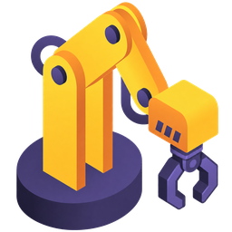

<h1 align="center">
  
  Vision-Language-Action Models for Diverse Application Scenarios: A Survey of Input Modalities
</h1>

  <strong>A companion repository for a survey on input modalities in Vision-Language-Action models.</strong>

  
  
  
  

🔥 This repository accompanies our survey on input modalities for Vision-Language-Action (VLA) models. We are currently organizing the full paper list, taxonomy, and supplementary resources.

- We maintain a curated resource list for VLA input modalities across embodied agents, robotic manipulation, navigation, and related physical decision-making tasks.
- The repository follows the paper structure: vision-language modalities, VLAs with a single additional modality, and VLAs with multiple additional modalities.
- If you find missing papers, incorrect metadata, broken links, or taxonomy issues, please open an issue or submit a pull request.

## Table of Contents

- [🤖 Overview](#overview)
- [🔍 Input Modalities in VLAs](#input-modalities-in-vlas)
- [ Vision-Language Modalities in VLAs](#vision-language-modalities-in-vlas)
  - [Language Modality](#language-modality)
  - [Vision Modality](#vision-modality)
  - [Vision-Language to Action Modeling](#vision-language-to-action-modeling)
- [ VLAs with Single Additional Modality](#vlas-with-single-additional-modality)
  - [Depth Modality](#depth-modality)
  - [Point Cloud Modality](#point-cloud-modality)
  - [Tactile Modality](#tactile-modality)
  - [Force Modality](#force-modality)
  - [Audio Modality](#audio-modality)
  - [Gaze Modality](#gaze-modality)
  - [Other Emerging Modalities](#other-emerging-modalities)
- [ VLAs with Multiple Additional Modalities](#vlas-with-multiple-additional-modalities)
  - [Depth and Point Cloud Modalities (3D Geometry)](#depth-and-point-cloud-modalities-3d-geometry)
  - [Tactile and Force Modalities](#tactile-and-force-modalities)
  - [Other Multiple Additional Modalities](#other-multiple-additional-modalities)
- [🤝 Acknowledgements](#acknowledgements)
- [📖 Citation](#citation)
- [📄 License](#license)

## Overview

Vision-Language-Action models increasingly rely on diverse input signals beyond standard RGB observations. This survey studies how different modalities contribute to perception, grounding, planning, control, and human-agent interaction in VLA systems.

## Input Modalities in VLAs

| Modality | Representative VLA Application Scenarios | Task-Relevant Information |
| --- | --- | --- |
| 🖼️ RGB Image | General object-centric manipulation and scene understanding | Object appearance, scene context, and visual state observations |
| 🎞️ Video | Long-horizon, dynamic, or temporally dependent manipulation | Motion history, temporal context, and action-relevant dynamics |
| 💬 Language | Instruction-conditioned manipulation and goal specification | Task goals, constraints, and semantic instructions |
| 📏 Depth | Precision manipulation, obstacle avoidance, and spatial alignment | Metric distance, depth ordering, and image-aligned spatial structure |
| ☁️ Point Cloud | Complex 3D manipulation and pose-aware interaction | 3D geometry, object shape, and point-level spatial structure |
| ✋ Tactile | Contact-rich manipulation, insertion, grasping, and slip handling | Local contact state, deformation, and tactile feedback |
| 🧲 Force | Force-aware contact manipulation and compliant control | Interaction force, torque, and contact intensity |
| 🔊 Audio | Sound-producing manipulation and interactive tasks | Contact sounds, speech cues, and intent-related acoustic signals |
| ⚡ Event Stream | Low-light, high-speed, or motion-blurred manipulation | Asynchronous motion cues and brightness-change events |
| 🌡️ Thermal Image | Low-light, reflective, or temperature-sensitive operation | Heat distribution, material state, and non-visible environmental cues |
| 👁️ Gaze | Ambiguous or human-in-the-loop interaction | Human attention, target preference, and intent cues |
| 🧠 Brain Signal | Assistive control and human-guided intervention | Neural intention signals and intervention commands |
| 📡 Radar | Occluded-object or hidden-state manipulation | Radar reflections, through-occlusion cues, and hidden-object responses |

## Vision-Language Modalities in VLAs

This section covers VLA methods that keep the standard vision-language input interface while focusing on how the two modalities are specified, represented, fused, and converted into actions.

### Language Modality

> These works use the canonical vision-language input interface and focus on how language specifies tasks, goals, reasoning contexts, and instruction variants for VLA policies.

- **LIBERO-Para** - *LIBERO-Para: A Diagnostic Benchmark and Metrics for Paraphrase Robustness in VLA Models*  
  

- **IGAR** - *Restoring Linguistic Grounding in VLA Models via Train-Free Attention Recalibration*  
  

- **LangGap** - *LangGap: Diagnosing and Closing the Language Gap in Vision-Language-Action Models*  
  

- **CAG** - *When Vision Overrides Language: Evaluating and Mitigating Counterfactual Failures in VLAs*  
   

- **LangForce** - *LangForce: Bayesian Decomposition of Vision Language Action Models via Latent Action Queries*  
  

- **RSS** - *Stable Language Guidance for Vision-Language-Action Models*  
  

- **BayesVLA** - *Seeing to Act, Prompting to Specify: A Bayesian Factorization of Vision Language Action Policy*  
   

- **MG-Select** - *Verifier-free Test-Time Sampling for Vision Language Action Models*  
  

- **VLA-Reasoner** - *VLA-Reasoner: Empowering Vision-Language-Action Models with Reasoning via Online Monte Carlo Tree Search*  
   

- **RICL** - *RICL: Adding In-Context Adaptability to Pre-Trained Vision-Language-Action Models*  
   

- **InstructVLA** - *InstructVLA: Vision-Language-Action Instruction Tuning from Understanding to Manipulation*  
  

- **RoboMonkey** - *RoboMonkey: Scaling Test-Time Sampling and Verification for Vision-Language-Action Models*  
  

- **FSD** - *From Seeing to Doing: Bridging Reasoning and Decision for Robotic Manipulation*  
   

- **CoA-VLA** - *CoA-VLA: Improving Vision-Language-Action Models via Visual-Textual Chain-of-Affordance*  
   

- **ECoT** - *Robotic Control via Embodied Chain-of-Thought Reasoning*  
   

- **RT-2** - *RT-2: Vision-Language-Action Models Transfer Web Knowledge to Robotic Control*  
   

- **PaLM-E** - *PaLM-E: An Embodied Multimodal Language Model*  
   

- **SayCan** - *Do As I Can, Not As I Say: Grounding Language in Robotic Affordances*  
   

### Vision Modality

> These works also remain within the vision-language input setting, but focus on the visual side: viewpoints, temporal context, object-centric cues, pixel-level grounding, and visual prompting.

- **Sentinel-VLA** - *Sentinel-VLA: A Metacognitive VLA Model with Active Status Monitoring for Dynamic Reasoning and Error Recovery*  
  

- **VP-VLA** - *VP-VLA: Visual Prompting as an Interface for Vision-Language-Action Models*  
   

- **ReMem-VLA** - *ReMem-VLA: Empowering Vision-Language-Action Model with Memory via Dual-Level Recurrent Queries*  
  

- **AnyCamVLA** - *AnyCamVLA: Zero-Shot Camera Adaptation for Viewpoint Robust Vision-Language-Action Models*  
   

- **JALA** - *Joint-Aligned Latent Action: Towards Scalable VLA Pretraining in the Wild*  
  

- **BFA++** - *BFA++: Hierarchical Best-Feature-Aware Token Prune for Multi-View Vision Language Action Model*  
  

- **Selective Perception** - *Selective Perception for Robot: Task-Aware Attention in Multimodal VLA*  
  

- **Dream4manip** - *Say, Dream, and Act: Learning Video World Models for Instruction-Driven Robot Manipulation*  
  

- **DySta** - *Efficient Long-Horizon Vision-Language-Action Models via Static-Dynamic Disentanglement*  
  

- **MVP-LAM** - *MVP-LAM: Learning Action-Centric Latent Action via Cross-Viewpoint Reconstruction*  
  

- **Point-VLA** - *Point What You Mean: Visually Grounded Instruction Policy*  
  

- **VideoVLA** - *VideoVLA: Video Generators Can Be Generalizable Robot Manipulators*  
   

- **PixelVLA** - *PixelVLA: Advancing Pixel-level Understanding in Vision-Language-Action Model*  
  

- **ContextVLA** - *ContextVLA: Vision-Language-Action Model with Amortized Multi-Frame Context*  
   

- **RS-CL** - *Contrastive Representation Regularization for Vision-Language-Action Models*  
  

- **HAMLET** - *HAMLET: Switch your Vision-Language-Action Model into a History-Aware Policy*  
   

- **VLA-LPAF** - *VLA-LPAF: Lightweight Perspective-Adaptive Fusion for Vision-Language-Action to Enable More Unconstrained Robotic Manipulation*  
  

- **FlowVLA** - *FlowVLA: Visual Chain of Thought-based Motion Reasoning for Vision-Language-Action Models*  
   

- **OC-VLA** - *Grounding Actions in Camera Space: Observation-Centric Vision-Language-Action Policy*  
  

- **ReconVLA** - *ReconVLA: Reconstructive Vision-Language-Action Model as Effective Robot Perceiver*  
   

- **EgoVLA** - *EgoVLA: Learning Vision-Language-Action Models from Egocentric Human Videos*  
   

- **CrayonRobo** - *CrayonRobo: Object-Centric Prompt-Driven Vision-Language-Action Model for Robotic Manipulation*  
  

- **UP-VLA** - *UP-VLA: A Unified Understanding and Prediction Model for Embodied Agent*  
  

- **EF-VLA** - *Early Fusion Helps Vision Language Action Models Generalize Better*  
  

- **RoboVLMs** - *What Matters in Building Vision-Language-Action Models for Generalist Robots*  
  

- **TraceVLA** - *TraceVLA: Visual Trace Prompting Enhances Spatial-Temporal Awareness for Generalist Robotic Policies*  
  

- **Moto** - *Moto: Latent Motion Token as the Bridging Language for Learning Robot Manipulation from Videos*  
   

- **GR-2** - *GR-2: A Generative Video-Language-Action Model with Web-Scale Knowledge for Robot Manipulation*  
   

- **GR-MG** - *GR-MG: Leveraging Partially Annotated Data via Multi-Modal Goal-Conditioned Policy*  
   

- **Octo** - *Octo: An Open-Source Generalist Robot Policy*  
   

- **GR-1** - *Unleashing Large-Scale Video Generative Pre-training for Visual Robot Manipulation*  
   

- **RT-Trajectory** - *RT-Trajectory: Robotic Task Generalization via Hindsight Trajectory Sketches*  
   

- **RoboFlamingo** - *Vision-Language Foundation Models as Effective Robot Imitators*  
   

- **SuSIE** - *Zero-Shot Robotic Manipulation with Pretrained Image-Editing Diffusion Models*  
   

- **RT-1** - *RT-1: Robotics Transformer for Real-World Control at Scale*  
   

### Vision-Language to Action Modeling

> These works use vision-language inputs while focusing on architecture and action modeling, including action tokenization, diffusion/flow action heads, reinforcement learning, robustness, and efficient inference.

- **STRONG-VLA** - *STRONG-VLA: Decoupled Robustness Learning for Vision-Language-Action Models under Multimodal Perturbations*  
  

- **MMaDA-VLA** - *MMaDA-VLA: Large Diffusion Vision-Language-Action Model with Unified Multi-Modal Instruction and Generation*  
  

- **OptimusVLA** - *Global Prior Meets Local Consistency: Dual-Memory Augmented Vision-Language-Action Model for Efficient Robotic Manipulation*  
  

- **VLA-Pruner** - *Bridging the Semantic-Action Gap in Visual Token Pruning for Efficient VLA Inference*  
  

- **pi_RL** - *$\pi_{\texttt{RL}}$: Online RL Fine-tuning for Flow-based Vision-Language-Action Models*  
  

- **dVLA** - *dVLA: Diffusion Vision-Language-Action Model with Multimodal Chain-of-Thought*  
  

- **SimpleVLA-RL** - *SimpleVLA-RL: Scaling VLA Training via Reinforcement Learning*  
  

- **RIPT-VLA** - *Interactive Post-Training for Vision-Language-Action Models*  
   

- **GR00T N1** - *GR00T N1: An Open Foundation Model for Generalist Humanoid Robots*  
   

- **HybridVLA** - *HybridVLA: Collaborative Diffusion and Autoregression in a Unified Vision-Language-Action Model*  
  

- **OTTER** - *OTTER: A Vision-Language-Action Model with Text-Aware Visual Feature Extraction*  
   

- **VLA-Cache** - *VLA-Cache: Efficient Vision-Language-Action Manipulation via Adaptive Token Caching*  
   

- **iRe-VLA** - *Improving Vision-Language-Action Model with Online Reinforcement Learning*  
  

- **pi_0** - *$\pi_0$: A Vision-Language-Action Flow Model for General Robot Control*  
   

- **OpenVLA** - *OpenVLA: An Open-Source Vision-Language-Action Model*  
   

## VLAs with Single Additional Modality

This section covers VLA methods that add one extra input channel to address scenario-specific information needs beyond RGB observations and language instructions.

### Depth Modality

> Depth mainly provides metric distance and image-aligned spatial-layout cues for localization, obstacle awareness, and action constraints.

- **SOMA** - *Spatial Memory for Out-of-Vision Manipulation in Vision-Language-Action*  
  

- **Evo-Depth** - *Evo-Depth: A Lightweight Depth-Enhanced Vision-Language-Action Model*  
  

- **GST-VLA** - *GST-VLA: Structured Gaussian Spatial Tokens for 3D Depth-Aware Vision-Language-Action Models*  
  

- **UniLACT** - *UniLACT: Depth-Aware RGB Latent Action Learning for Vision-Language-Action Models*  
   

- **AutoFly** - *AutoFly: Vision-Language-Action Model for UAV Autonomous Navigation in the Wild*  
  

- **PEAfowl** - *PEAfowl: Perception-Enhanced Multi-View Vision-Language-Action for Bimanual Manipulation*  
   

- **ActiveVLA** - *ActiveVLA: Injecting Active Perception into Vision-Language-Action Models for Precise 3D Robotic Manipulation*  
  

- **GeoPredict** - *GeoPredict: Leveraging Predictive Kinematics and 3D Gaussian Geometry for Precise VLA Manipulation*  
  

- **VIPA-VLA** - *Spatial-Aware VLA Pretraining through Visual-Physical Alignment from Human Videos*  
  

- **FALCON** - *From Spatial to Actions: Grounding Vision-Language-Action Model in Spatial Foundation Priors*  
   

- **DepthVLA** - *DepthVLA: Enhancing Vision-Language-Action Models with Depth-Aware Spatial Reasoning*  
  

- **Spatial Forcing** - *Spatial Forcing: Implicit Spatial Representation Alignment for Vision-language-action Model*  
   

### Point Cloud Modality

> Point clouds provide explicit 3D spatial structure beyond image-plane observations, supporting object shape, reachability, and workspace-aware action reasoning.

- **PointACT** - *PointACT: Vision-Language-Action Models with Multi-Scale Point-Action Interaction*  
   

- **LaMP** - *LaMP: Learning Vision-Language-Action Policies with 3D Scene Flow as Latent Motion Prior*  
   

- **UniDex** - *UniDex: A Robot Foundation Suite for Universal Dexterous Hand Control from Egocentric Human Videos*  
  

- **Avi** - *Avi: Action from Volumetric Inference*  
   

- **GeoVLA** - *GeoVLA: Empowering 3D Representations in Vision-Language-Action Models*  
   

- **BridgeVLA** - *BridgeVLA: Input-Output Alignment for Efficient 3D Manipulation Learning with Vision-Language Models*  
   

- **OG-VLA** - *OG-VLA: Orthographic Image Generation for 3D-Aware Vision-Language Action Model*  
   

- **PointVLA** - *PointVLA: Injecting the 3D World into Vision-Language-Action Models*  
  

- **3D-VLA** - *3D-VLA: A 3D Vision-Language-Action Generative World Model*  
  

### Tactile Modality

> Tactile inputs provide local contact observations such as deformation, slip, and contact state, making them useful for insertion, grasping, and other contact-rich manipulation tasks.

- **T-Rex** - *T-Rex: Tactile-Reactive Dexterous Manipulation*  
   

- **TacCoRL** - *TacCoRL: Integrating Tactile Feedback into VLA via Simulation*  
   

- **AT-VLA** - *AT-VLA: Adaptive Tactile Injection for Enhanced Feedback Reaction in Vision-Language-Action Models*  
   

- **TacFiLM** - *Tactile Modality Fusion for Vision-Language-Action Models*  
  

- **TacVLA** - *TacVLA: Contact-Aware Tactile Fusion for Robust Vision-Language-Action Manipulation*  
   

- **FG-CLTP** - *FG-CLTP: Fine-Grained Contrastive Language Tactile Pretraining for Robotic Manipulation*  
  

- **DreamTacVLA** - *Learning to Feel the Future: DreamTacVLA for Contact-Rich Manipulation*  
  

- **VLA-Touch** - *VLA-Touch: Enhancing Vision-Language-Action Models with Dual-Level Tactile Feedback*  
  

- **VTLA** - *VTLA: Vision-Tactile-Language-Action Model with Preference Learning for Insertion Manipulation*  
   

- **TLA** - *TLA: Tactile-Language-Action Model for Contact-Rich Manipulation*  
   

- **BiTLA** - *BiTLA: A Bimanual Tactile-Language-Action Model for Contact-Rich Robotic Manipulation*  
  

### Force Modality

> Force-aware VLAs use force or torque feedback to model interaction intensity and support hybrid force-position control, gentle manipulation, and contact correction.

- **ForceVLA2** - *ForceVLA2: Unleashing Hybrid Force-Position Control with Force Awareness for Contact-Rich Manipulation*  
   

- **FAVLA** - *FAVLA: A Force-Adaptive Fast-Slow VLA model for Contact-Rich Robotic Manipulation*  
  

- **CRAFT** - *CRAFT: Adapting VLA Models to Contact-rich Manipulation via Force-aware Curriculum Fine-tuning*  
  

- **FD-VLA** - *FD-VLA: Force-Distilled Vision-Language-Action Model for Contact-Rich Manipulation*  
  

- **NeuroVLA** - *A Brain-inspired Embodied Intelligence for Fluid and Fast Reflexive Robotics Control*  
  

- **TA-VLA** - *TA-VLA: Elucidating the Design Space of Torque-aware Vision-Language-Action Models*  
   

- **ForceVLA** - *ForceVLA: Enhancing VLA Models with a Force-aware MoE for Contact-rich Manipulation*  
   

### Audio Modality

> Audio expands the VLA interface with speech instructions, contact sounds, and environmental acoustic cues that may be unavailable from vision alone.

- **HEAR** - *Towards the Vision-Sound-Language-Action Paradigm: The HEAR Framework for Sound-Centric Manipulation*  
  

- **Audio-VLA** - *Audio-VLA: Adding Contact Audio Perception to Vision-Language-Action Model for Robotic Manipulation*  
  

- **RoboOmni** - *RoboOmni: Proactive Robot Manipulation in Omni-modal Context*  
  

- **VITA-E** - *VITA-E: Natural Embodied Interaction with Concurrent Seeing, Hearing, Speaking, and Acting*  
   

- **ELLSA** - *End-to-end Listen, Look, Speak and Act*  
  

- **RoboEgo** - *RoboEgo System Card: An Omnimodal Model with Native Full Duplexity*  
  

- **VLAS** - *VLAS: Vision-Language-Action Model With Speech Instructions For Customized Robot Manipulation*  
  

- **SVA** - *SVA: Towards Speech-Enabled Vision-Language-Action Model*  
  

- **RoboNurse-VLA** - *RoboNurse-VLA: Robotic Scrub Nurse System based on Vision-Language-Action Model*  
   

### Gaze Modality

> Gaze-conditioned VLAs use human attention as an intent cue, helping robots infer targets, preferences, or interaction focus in human-centered manipulation.

- **Gaze2Act** - *Gaze2Act: Gaze-Conditioned Vision-Language-Action Policies for Interactive Robot Manipulation*  
   

- **GazeVLA** - *GazeVLA: Learning Human Intention for Robotic Manipulation*  
   

- **Gaze-Regularized VLA** - *Gaze-Regularized Vision-Language-Action Models for Robotic Manipulation*  
  

- **DAA** - *Multi-task real-robot data with gaze attention for dual-arm fine manipulation*  
   

### Other Emerging Modalities

> This section collects newer input channels such as gesture, thermal, event, and other specialized signals that expand VLA perception beyond standard vision-language inputs.

- **GIVE** - *GIVE: Grounding Human Gestures in Vision-Language-Action Models*  
   

- **GesVLA** - *GesVLA: Gesture-Aware Vision-Language-Action Model Embedded Representations*  
   

- **E-VLA** - *E-VLA: Event-Augmented Vision-Language-Action Model for Dark and Blurred Scenes*  
  

- **ThermoAct** - *ThermoAct: Thermal-Aware Vision-Language-Action Models for Robotic Perception and Decision-Making*  
  

- **Safe-Night VLA** - *Safe-Night VLA: Seeing the Unseen via Thermal-Perceptive Vision-Language-Action Models for Safety-Critical Manipulation*  
  

- **SignVLA** - *SignVLA: A Gloss-Free Vision-Language-Action Framework for Real-Time Sign Language-Guided Robotic Manipulation*  
  

- **Expert-VLA** - *VLA Model-Expert Collaboration for Bi-directional Manipulation Learning*  
   

## VLAs with Multiple Additional Modalities

This section covers VLA methods that combine multiple additional modalities for tasks where geometry, contact, and environmental signals jointly affect action generation.

### Depth and Point Cloud Modalities (3D Geometry)

> This 3D geometry branch combines depth cues and point-level structure, moving from distance estimation toward action-relevant spatial modeling.

- **GEAR-VLA** - *GEAR-VLA: Learning Geometry-Aware Action Representations for Generalizable Robotic Manipulation*  
  

- **MotionVLA** - *MotionVLA: Injecting Geometric Motion into Vision-Language-Action Model*  
  

- **DiffRender-VLA** - *Localizing, Structuring, and Rendering: Bridging 3D and 2D Vision-Language-Action Models for Robotic Manipulation*  
  

- **StemVLA** - *StemVLA: An Open-Source Vision-Language-Action Model with Future 3D Spatial Geometry Knowledge and 4D Historical Representation*  
  

- **AugVLA-3D** - *AugVLA-3D: Depth-Driven Feature Augmentation for Vision-Language-Action Models*  
  

- **Any3D-VLA** - *Any3D-VLA: Enhancing VLA Robustness via Diverse Point Clouds*  
   

- **4D-VLA** - *4D-VLA: Spatiotemporal Vision-Language-Action Pretraining with Cross-Scene Calibration*  
  

- **3D-CAVLA** - *3D CAVLA: Leveraging Depth and 3D Context to Generalize Vision Language Action Models for Unseen Tasks*  
   

- **RoboFlamingo-Plus** - *RoboFlamingo-Plus: Fusion of Depth and RGB Perception with Vision-Language Models for Enhanced Robotic Manipulation*  
  

- **RoboMM** - *RoboTron-Mani: All-in-One Multimodal Large Model for Robotic Manipulation*  
  

### Tactile and Force Modalities

> These methods combine local touch and mechanical feedback, allowing VLAs to perceive contact state while regulating interaction force during execution.

- **TORL-VLA** - *TORL-VLA: Tactile Guided Online Reinforcement Learning for Contact-Rich Manipulation*  
   

- **Tabero** - *Tabero: Learning Gentle Manipulation with Closed-Loop Force Feedback from Vision, Touch, and Language*  
  

- **HapticVLA** - *HapticVLA: Contact-Rich Manipulation via Vision-Language-Action Model without Inference-Time Tactile Sensing*  
  

- **MoDE-VLA** - *Towards Human-Like Manipulation through RL-Augmented Teleoperation and Mixture-of-Dexterous-Experts VLA*  
   

- **TaF-VLA** - *TaF-VLA: Tactile-Force Alignment in Vision-Language-Action Models for Force-aware Manipulation*  
  

- **Cui et al.** - *End-to-End Dexterous Arm-Hand VLA Policies via Shared Autonomy: VR Teleoperation Augmented by Autonomous Hand VLA Policy for Efficient Data Collection*  
  

- **Tactile-VLA** - *Tactile-VLA: Unlocking Vision-Language-Action Model's Physical Knowledge for Tactile Generalization*  
  

### Other Multiple Additional Modalities

> These works explore task-specific multisensory mixtures where several physical signals are needed to handle complex or long-tail scenarios.

- **OmniVLA** - *OmniVLA: Physically-Grounded Multimodal VLA with Unified Multi-Sensor Perception for Robotic Manipulation*  
  

- **MLA** - *MLA: A Multisensory Language-Action Model for Multimodal Understanding and Forecasting in Robotic Manipulation*  
   

- **Zhang et al.** - *A Unified Perception-Language-Action Framework for Adaptive Autonomous Driving*  
  

- **FuSe** - *Beyond Sight: Finetuning Generalist Robot Policies with Heterogeneous Sensors via Language Grounding*  
  

## Acknowledgements

> This repository is inspired by the open curation style of community survey repositories, including [Awesome World Models for Robotic Policy Learning](https://github.com/NTUMARS/Awesome-World-Model-for-Robotics-Policy) and [Large VLM-based VLA for Robotic Manipulation](https://github.com/JiuTian-VL/Large-VLM-based-VLA-for-Robotic-Manipulation). We thank their maintainers for making these resources public.

## Citation

> The citation entry will be added after the preprint is publicly available.

## License

> This repository is released under the [Creative Commons Attribution 4.0 International License](LICENSE).
